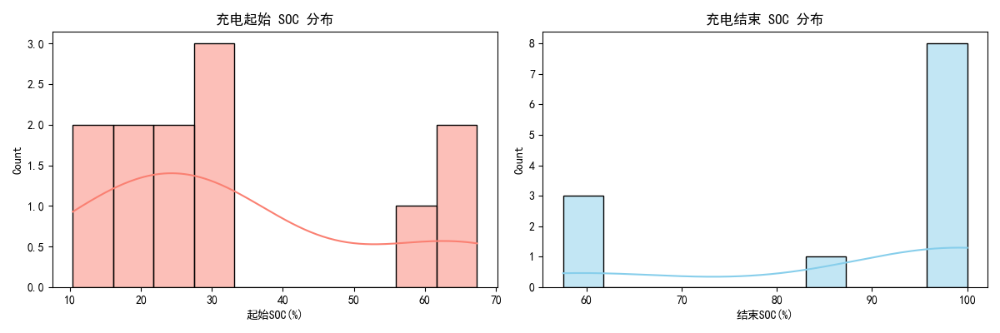
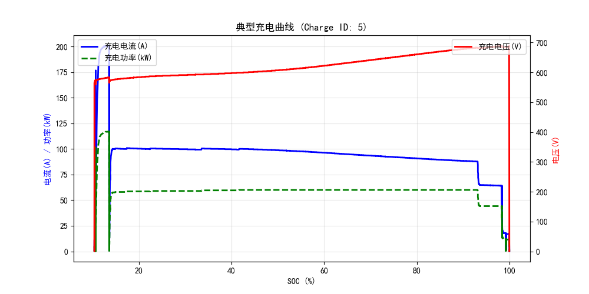
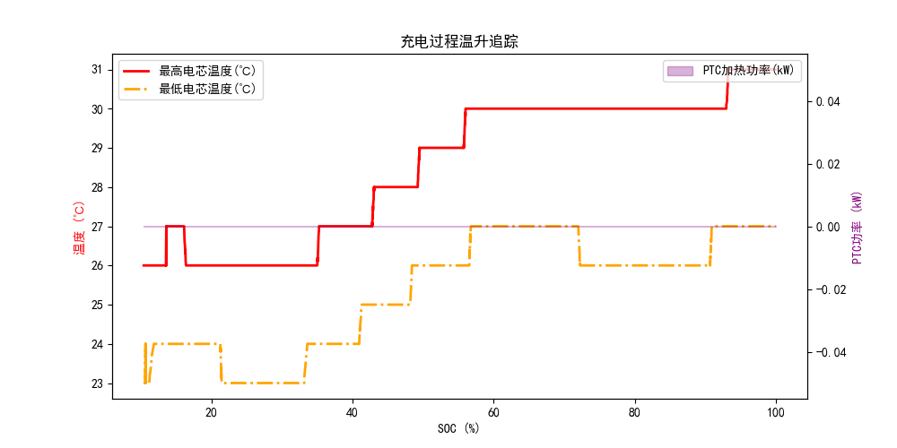

# 岚图 VOYAH 单车充电深度分析报告 (VIN: 6993)
> 本报告围绕充电曲线、效率、温升、偏好等 7 大维度自动生成。

## 6. 充电段识别与分段
- **独立充电总次数**: `13` 次
### 有效充电记录清单 (Top 10)
|    |   Charge_ID | 开始时间         |   时长(分钟) |   起始SOC(%) |   结束SOC(%) |   SOC增量(%) |   峰值功率(kW) |
|---:|------------:|:-----------------|-------------:|-------------:|-------------:|-------------:|---------------:|
|  0 |           1 | 2026-03-01 00:22 |         55.5 |        27.05 |        99.95 |        72.9  |          119.8 |
|  1 |           2 | 2026-03-05 20:10 |         21.8 |        20.05 |        60.5  |        40.45 |          120.2 |
|  2 |           4 | 2026-03-11 00:07 |         40.2 |        24.85 |        99.95 |        75.1  |          119.8 |
|  3 |           5 | 2026-03-12 00:19 |         71.9 |        10.4  |       100    |        89.6  |          117.2 |
|  4 |           6 | 2026-03-19 07:45 |         15.6 |        33.05 |        58.5  |        25.45 |          120   |
|  5 |           7 | 2026-03-20 20:14 |         48.7 |        32    |        99.95 |        67.95 |          119.8 |
|  6 |           8 | 2026-03-25 00:11 |         55.7 |        20.15 |        99.95 |        79.8  |          120.4 |
|  7 |           9 | 2026-03-28 00:02 |         31   |        65.45 |        99.95 |        34.5  |           98   |
|  8 |          10 | 2026-04-03 07:32 |         26.6 |        59.9  |        99.95 |        40.05 |          114.4 |
|  9 |          11 | 2026-04-05 17:23 |         11.7 |        12.2  |        57.55 |        45.35 |          156.2 |

## 4. 充电时长与充电量分析
- **平均充电时长**: `36.0` 分钟
- **平均 SOC 增量**: `55.0` %
- **历史最高峰值功率**: `156.2` kW

## 5. 用户充电 SOC 区间偏好

## 1. 典型快充曲线特征 (CC-CV)

## 2. 充电效率分析
- **平均充电机到电池的能量转换效率**: `97.39` %
### 不同 SOC 区间的充电效率
| SOC区间   |   平均效率(%) |
|:----------|--------------:|
| 0-30%     |       96.679  |
| 30-60%    |       98.358  |
| 60-80%    |       98.5059 |
| 80-100%   |       96.1156 |

## 3. 充电温升与热管理分析

## 7. 充电安全性指标检测
- **记录最高电芯温度**: `39.0` ℃ (建议安全阈值: <55℃)
- **记录最高电池包电压**: `691.5` V
- **最大电芯温差**: `5.0` ℃ (若温差过大可能暗示内阻不一致或热管理冷却不均)

