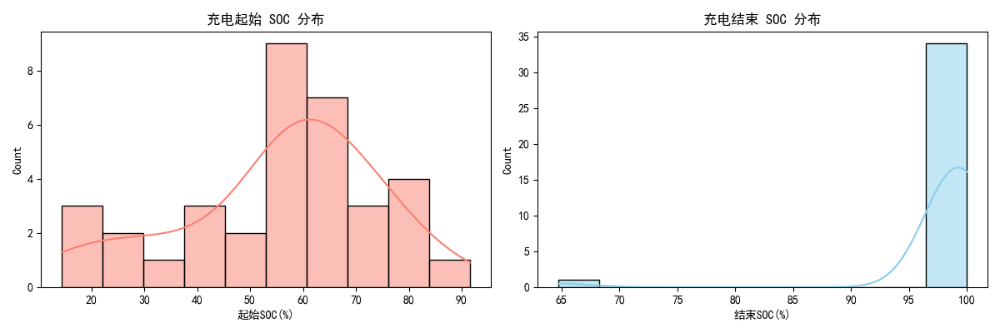
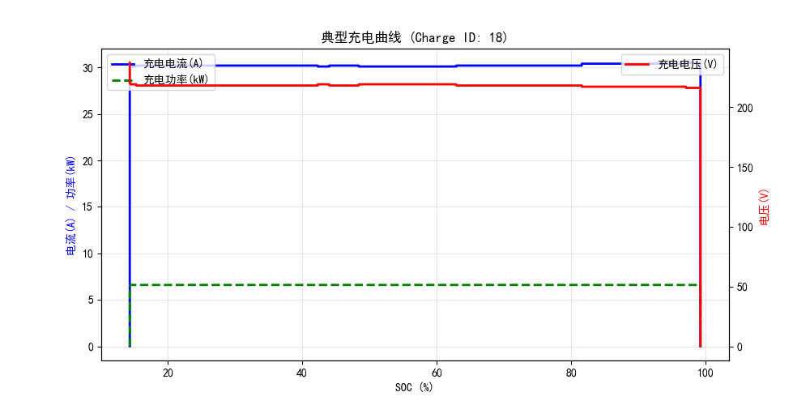
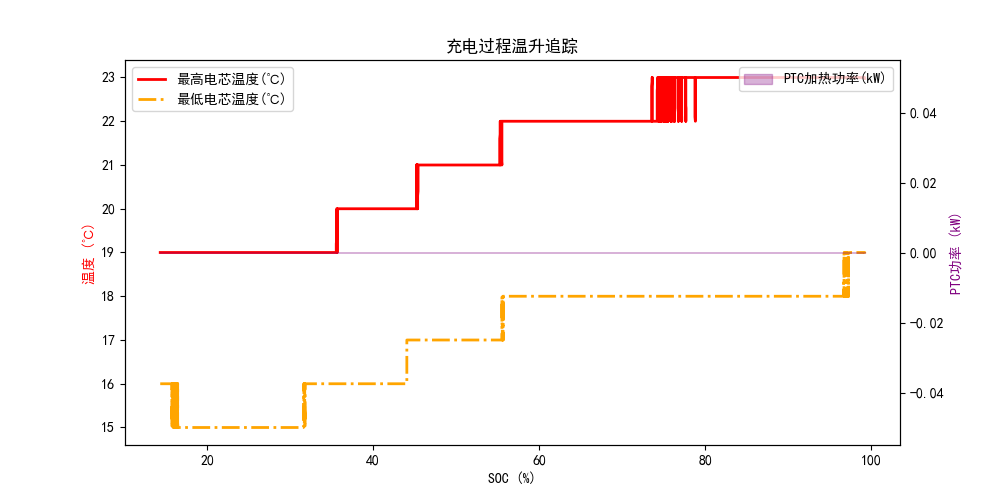

# 岚图 VOYAH 单车充电深度分析报告 (VIN: 7752)
> 本报告围绕充电曲线、效率、温升、偏好等 7 大维度自动生成。

## 6. 充电段识别与分段
- **独立充电总次数**: `35` 次
### 有效充电记录清单 (Top 10)
|    |   Charge_ID | 开始时间         |   时长(分钟) |   起始SOC(%) |   结束SOC(%) |   SOC增量(%) |   峰值功率(kW) |
|---:|------------:|:-----------------|-------------:|-------------:|-------------:|-------------:|---------------:|
|  0 |           1 | 2026-03-01 00:00 |        251.1 |        58.25 |         99.2 |        40.95 |            6.6 |
|  1 |           2 | 2026-03-01 23:30 |        245.6 |        59.4  |         99.2 |        39.8  |            6.6 |
|  2 |           3 | 2026-03-02 23:30 |        229.3 |        62.4  |         99.2 |        36.8  |            6.6 |
|  3 |           4 | 2026-03-04 23:30 |        407.6 |        31.05 |         99.2 |        68.15 |            6.6 |
|  4 |           5 | 2026-03-05 23:30 |        252.1 |        58.55 |         99.2 |        40.65 |            6.6 |
|  5 |           6 | 2026-03-06 23:30 |        275.6 |        54.95 |         99.2 |        44.25 |            6.6 |
|  6 |           7 | 2026-03-07 13:28 |         31.9 |        26.6  |        100   |        73.4  |          120   |
|  7 |           8 | 2026-03-08 23:30 |        481.5 |        20.05 |         99.2 |        79.15 |            6.6 |
|  8 |           9 | 2026-03-09 23:30 |        142   |        76.85 |         99.2 |        22.35 |            6.6 |
|  9 |          10 | 2026-03-10 23:30 |        150.1 |        76.55 |         99.2 |        22.65 |            6.6 |

## 4. 充电时长与充电量分析
- **平均充电时长**: `255.5` 分钟
- **平均 SOC 增量**: `42.7` %
- **历史最高峰值功率**: `120.0` kW

## 5. 用户充电 SOC 区间偏好

## 1. 典型快充曲线特征 (CC-CV)

## 2. 充电效率分析
- **平均充电机到电池的能量转换效率**: `96.05` %
### 不同 SOC 区间的充电效率
| SOC区间   |   平均效率(%) |
|:----------|--------------:|
| 0-30%     |       95.749  |
| 30-60%    |       95.3954 |
| 60-80%    |       95.6883 |
| 80-100%   |       96.5352 |

## 3. 充电温升与热管理分析

## 7. 充电安全性指标检测
- **记录最高电芯温度**: `36.0` ℃ (建议安全阈值: <55℃)
- **记录最高电池包电压**: `726.8` V
- **最大电芯温差**: `7.0` ℃ (若温差过大可能暗示内阻不一致或热管理冷却不均)

