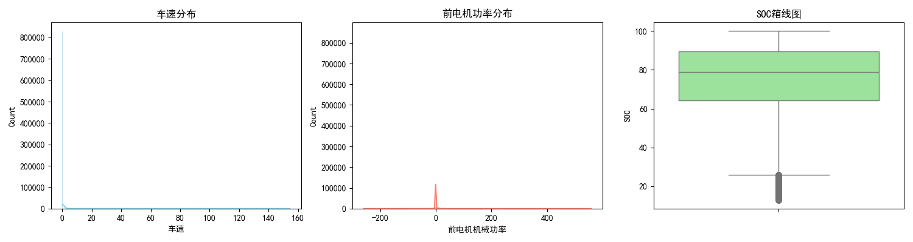
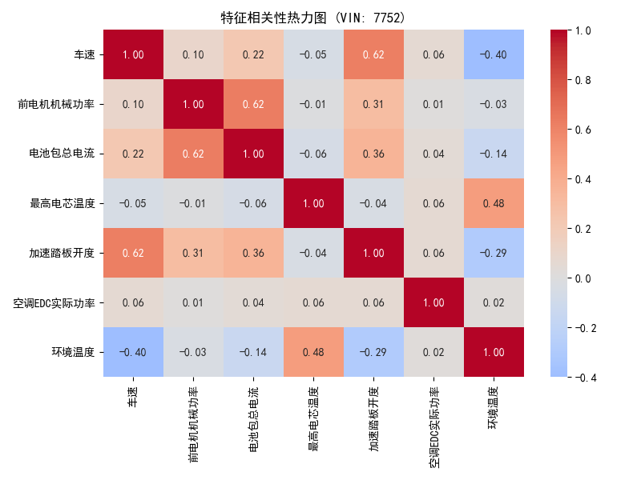

# 岚图 VOYAH 单车三电数据 EDA 分析报告 (VIN: 7752)
> 本报告由系统自动生成，旨在为深度学习模型（能耗/温度预测）提供数据先验特征支撑。

## 1. 基础描述统计
- **总数据量**: 1084154 行
### 1.1 数据缺失率概况 (Top 10)
|                  |   缺失率(%) |
|:-----------------|------------:|
| 智能驾驶是否开启 |     1.39694 |
| 时间轴           |     0       |
| 档位             |     0       |
| 车速             |     0       |
| vin              |     0       |
| 经度             |     0       |
| 纬度             |     0       |
| SOH              |     0       |
| SOC              |     0       |
| 环境温度         |     0       |

### 1.2 核心数值变量画像
|                |       mean |      std |      min |   50% |     max |     极差 |
|:---------------|-----------:|---------:|---------:|------:|--------:|---------:|
| 车速           |   8.62315  | 20.4739  |     0    |   0   | 154.519 |  154.519 |
| SOC            |  74.4824   | 19.6932  |    12.75 |  78.8 | 100     |   87.25  |
| 电池包总电压   | 677.497    | 32.3361  |     0    | 686.6 | 726.8   |  726.8   |
| 电池包总电流   |  -1.56286  | 41.7335  | -1630    |  -8.8 | 555.8   | 2185.8   |
| 前电机机械功率 |   0.467339 | 10.1916  |  -260    |   0   | 559     |  819     |
| 最高电芯温度   |  19.16     |  3.41405 |    -3    |  20   | 214     |  217     |
| 加速踏板开度   |   2.98555  |  8.79108 |     0    |   0   | 100     |  100     |

## 2. 分布形态分析
### 2.1 偏度分析 (大于0为右偏，小于0为左偏)
|                |   偏度 (Skewness) |
|:---------------|------------------:|
| 车速           |          2.95156  |
| SOC            |         -1.01116  |
| 电池包总电压   |         -0.993499 |
| 电池包总电流   |        -24.3332   |
| 前电机机械功率 |         16.8511   |
| 最高电芯温度   |         -0.180628 |
| 加速踏板开度   |          3.61893  |

## 3. 特征相关性分析

## 4. 时间序列特征
- **总时间跨度**: `2026-03-01 00:00:00` 至 `2026-04-09 23:59:59`
- **采样间隔 (中位数)**: `1.0` 秒

## 5. 驾驶行为与工况对比
### 5.1 不同驾驶模式下的动力平均特征
|   驾驶模式 |   前电机机械功率 |   车速 |   加速踏板开度 |
|-----------:|-----------------:|-------:|---------------:|
|          1 |             0.47 |   8.62 |           2.99 |

## 6. 效率与衍生指标 (Feature Engineering)
### 6.1 衍生指标分布特征
|                    |       mean |           min |          max |
|:-------------------|-----------:|--------------:|-------------:|
| 瞬时能耗率(kWh/km) |  0.0807875 |      -2.51412 |      3.80146 |
| 总输入电功率(kW)   | -1.09894   |   -1178.98    |    360.881   |
| PTC功率占比(%)     | 12.3766    | -297797       | 297826       |
| 空调功率占比(%)    |  0.164017  |    -434.72    |    158.128   |

