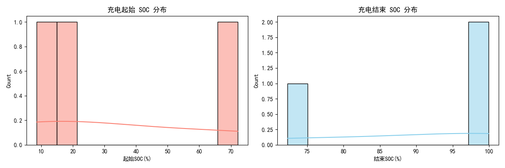
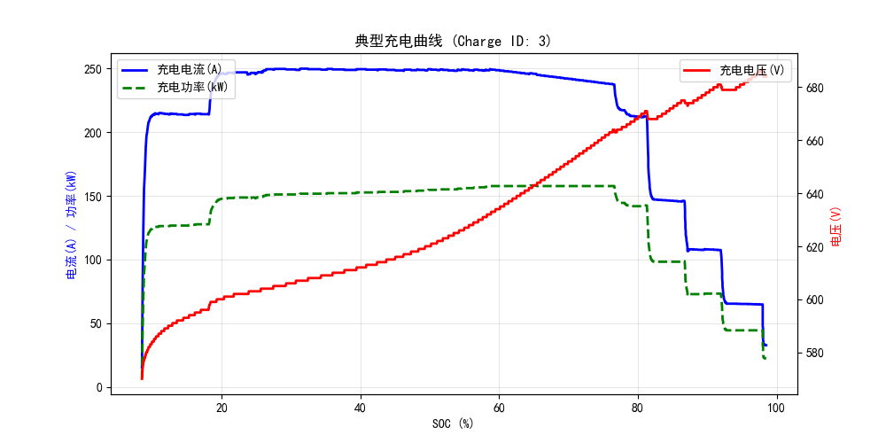
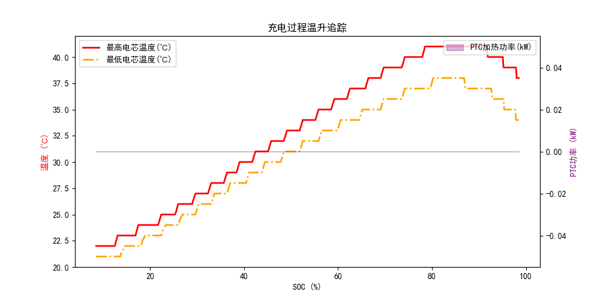

# 岚图 VOYAH 单车充电深度分析报告 (VIN: 8123)
> 本报告围绕充电曲线、效率、温升、偏好等 7 大维度自动生成。

## 6. 充电段识别与分段
- **独立充电总次数**: `3` 次
### 有效充电记录清单 (Top 10)
|    |   Charge_ID | 开始时间         |   时长(分钟) |   起始SOC(%) |   结束SOC(%) |   SOC增量(%) |   峰值功率(kW) |
|---:|------------:|:-----------------|-------------:|-------------:|-------------:|-------------:|---------------:|
|  0 |           1 | 2026-03-01 13:07 |         13.6 |         16.7 |        72.3  |        55.6  |            160 |
|  1 |           2 | 2026-03-01 13:27 |         17.4 |         72.2 |        99.95 |        27.75 |            145 |
|  2 |           3 | 2026-03-28 23:10 |         30.2 |          8.5 |        98.5  |        90    |            158 |

## 4. 充电时长与充电量分析
- **平均充电时长**: `20.4` 分钟
- **平均 SOC 增量**: `57.8` %
- **历史最高峰值功率**: `160.0` kW

## 5. 用户充电 SOC 区间偏好

## 1. 典型快充曲线特征 (CC-CV)

## 2. 充电效率分析
- **平均充电机到电池的能量转换效率**: `98.04` %
### 不同 SOC 区间的充电效率
| SOC区间   |   平均效率(%) |
|:----------|--------------:|
| 0-30%     |       96.8902 |
| 30-60%    |       99.7494 |
| 60-80%    |       99.326  |
| 80-100%   |       97.0931 |

## 3. 充电温升与热管理分析

## 7. 充电安全性指标检测
- **记录最高电芯温度**: `41.0` ℃ (建议安全阈值: <55℃)
- **记录最高电池包电压**: `687.1` V
- **最大电芯温差**: `5.0` ℃ (若温差过大可能暗示内阻不一致或热管理冷却不均)

