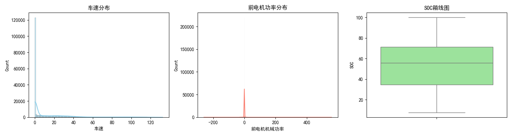
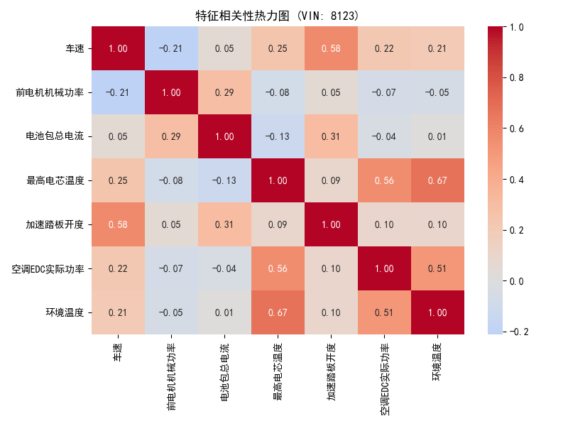

# 岚图 VOYAH 单车三电数据 EDA 分析报告 (VIN: 8123)
> 本报告由系统自动生成，旨在为深度学习模型（能耗/温度预测）提供数据先验特征支撑。

## 1. 基础描述统计
- **总数据量**: 245851 行
### 1.1 数据缺失率概况 (Top 10)
|                      |   缺失率(%) |
|:---------------------|------------:|
| 档位                 | 0.000813501 |
| 充电枪状态           | 0.000813501 |
| 充电状态             | 0.000813501 |
| 制动踏板状态（开度） | 0.000813501 |
| 混动模式             | 0.00040675  |
| 前空调开关           | 0.00040675  |
| 后空调开关           | 0.00040675  |
| 智能驾驶是否开启     | 0.00040675  |
| 能量回收模式         | 0.00040675  |
| 经度                 | 0           |

### 1.2 核心数值变量画像
|                |       mean |      std |     min |      50% |     max |     极差 |
|:---------------|-----------:|---------:|--------:|---------:|--------:|---------:|
| 车速           |  16.3424   | 26.1585  |     0   |   0.8438 | 132.412 |  132.412 |
| SOC            |  53.0133   | 25.3149  |     7.5 |  55.8    |  99.95  |   92.45  |
| 电池包总电压   | 608.529    | 33.3699  |   546.3 | 604.5    | 687.1   |  140.8   |
| 电池包总电流   |  -0.839691 | 43.3821  | -1630   |   0.8    | 209.5   | 1839.5   |
| 前电机机械功率 |  -0.583887 |  8.64729 |  -260   |   0      | 559     |  819     |
| 最高电芯温度   |  22.0447   |  5.27312 |    13   |  20      |  41     |   28     |
| 加速踏板开度   |   6.50437  | 12.2964  |     0   |   0      |  88.5   |   88.5   |

## 2. 分布形态分析
### 2.1 偏度分析 (大于0为右偏，小于0为左偏)
|                |   偏度 (Skewness) |
|:---------------|------------------:|
| 车速           |          2.03465  |
| SOC            |         -0.236224 |
| 电池包总电压   |          0.321549 |
| 电池包总电流   |        -17.1755   |
| 前电机机械功率 |         21.6981   |
| 最高电芯温度   |          1.42052  |
| 加速踏板开度   |          1.92037  |

## 3. 特征相关性分析

## 4. 时间序列特征
- **总时间跨度**: `2026-03-01 12:57:59` 至 `2026-04-09 21:08:59`
- **采样间隔 (中位数)**: `1.0` 秒

## 5. 驾驶行为与工况对比
### 5.1 不同驾驶模式下的动力平均特征
|   驾驶模式 |   前电机机械功率 |   车速 |   加速踏板开度 |
|-----------:|-----------------:|-------:|---------------:|
|          0 |            -0.58 |  16.34 |            6.5 |

## 6. 效率与衍生指标 (Feature Engineering)
### 6.1 衍生指标分布特征
|                    |        mean |         min |        max |
|:-------------------|------------:|------------:|-----------:|
| 瞬时能耗率(kWh/km) | -0.00347776 |    -1.06258 |    2.05725 |
| 总输入电功率(kW)   | -0.617752   | -1101.39    |  122.537   |
| PTC功率占比(%)     |  0.502867   | -1189.26    |  845.023   |
| 空调功率占比(%)    |  1.84041    | -1309.76    | 3693.28    |

