# 岚图 VOYAH 电动汽车三电数据挖掘与能耗预测 — 项目总结报告

> 基于岚图 H56D 车型三辆试验车（VIN: 6993 / 7752 / 8123）连续 40 天（2026-03-01 ~ 2026-04-09）秒级行车传感器数据，完成数据清洗、统计分析、可视化、充电/行程深度分析，并构建 **LSTM / BiLSTM / BiLSTM+Attention 三种深度学习模型**实现能耗预测对比。

---
- [项目文件结构](#项目文件结构)
- [必做作业](#必做作业)
  - [1. 读取数据](#1-读取数据)
  - [2. 数据清洗](#2-数据清洗)
  - [3. 差值补齐](#3-差值补齐)
  - [4. 统计分析](#4-统计分析)
  - [5. 可视化](#5-可视化)
- [选做作业](#选做作业)
  - [6. 充电分析](#6-充电分析)
  - [7. 行程分析](#7-行程分析)
  - [8. 能耗预测（三种网络对比）](#8-能耗预测三种网络对比)


---
```
project/
├── 项目总结报告.md                                 ← 本文档
└── SpdToPwr/
    ├── comparison_loss_curves.png
    └── comparison_metrics.png
    ├── data_split_tool.py                          # 数据读取、清洗、插值、分片
    ├── data_utils.py                               # 滑动窗口、行程切分、标准化、DataLoader
    ├── visualize_results.py                        # EDA可视化 + 训练结果可视化
    │
    ├── configs/                                    # 超参数配置
    │   ├── Bilstm_attention.py                     # BiLSTM+Attention 配置
    │   ├── lstm_config.py                          # LSTM 配置
    │   └── bilstm_config.py                        # BiLSTM 配置
    │
    ├── nn/                                         # 模型定义
    │   ├── model.py                                # 基础模型
    │   ├── model_lstm.py                           # LSTMPredictor
    │   ├── model_bilstm.py                         # BiLSTMPredictor
    │   └── model_improved.py                       # EVPowerImprovedModel + BahdanauAttention
    │
    ├── train/                                      # 训练脚本
    │   ├── train_lstm.py                           # LSTM 训练
    │   ├── train_bilstm.py                         # BiLSTM 训练
    │   ├── train_bilstm_a.py                       # BiLSTM+Attention 训练
    │   └── train_utils.py                          # EarlyStopping
    │
    ├──training_results/
    │   ├── lstm/                                   # LSTM 5 张图
    │   ├── bilstm/                                 # BiLSTM 5 张图
    │   ├── bilstm_attention/                       # BiLSTM+Attention 5 张图
    │   └── comparison/                             # 多模型对比 2 张图    
    ├── test/                                       # 测试脚本
    │   ├── test.py                                 # BiLSTM+Attention 测试
    │   ├── test_lstm.py                            # LSTM 测试
    │   └── test_bilstm.py                          # BiLSTM 测试
    │
    ├── models/                                     # 训练好的模型权重
    │   ├── best_model_lstm_power_prediction_6993.pth
    │   ├── best_model_bilstm_power_prediction_6993.pth
    │   └── best_model_power_prediction_6993.pth
    │
    ├── test_results/                               # BiLSTM+Attention 测试结果
    │   ├── predict_FULL_power_prediction_6993.png
    │   └── predict_ZOOM_power_prediction_6993.png
    ├── test_results_lstm/                          # LSTM 测试结果
    │   ├── predict_FULL_power_prediction_6993.png
    │   └── predict_ZOOM_power_prediction_6993.png
    ├── test_results_bilstm/                        # BiLSTM 测试结果
    │   ├── predict_FULL_power_prediction_6993.png
    │   └── predict_ZOOM_power_prediction_6993.png
    │
    ├── processedData/                              # CSV 分片 (vin_6993_chunk_0~35.csv)
    │
    └── analysis/                                   # 数据分析模块
        ├── eda_report_generator.py                 # EDA 报告生成器
        ├── Analysis_Charge.py                      # 充电分析（7 维度）
        ├── Analysis_generator.py                   # 行程分析（8 维度）
        ├── viz_utils.py                            # 可视化工具（5 维度）
        ├── analysis_results/                       # 全局分析图（4 张）
        ├── visualizations/                         # VIN 单车可视化（20 张）
        │   ├── 6993/                               # VIN 6993 × 5 张
        │   ├── 7752/                               # VIN 7752 × 5 张
        │   └── 8123/                               # VIN 8123 × 5 张
        └── EDA_Reports/                            # EDA 分析报告
            ├── 6993/                               # EDA报告 + 充电报告 + 7张图
            ├── 7752/                               # 同上
            └── 8123/                               # 同上
```


# 必做作业

## 1. 读取数据

### 1.1 数据来源

原始数据为单张 CSV 文件 `作业数据部分 - 副本.csv`（553 MB），包含三辆 H56D 试验车连续 40 天的全量行车传感器秒级数据，涵盖 40+ 个字段。

### 1.2 数据规模

| VIN | 数据行数 | 时间跨度 | 采样间隔 |
|-----|----------|----------|----------|
| 6993 | 357,156 | 2026-03-01 00:17:41 → 2026-04-09 23:45:02 | 1.0 秒 |
| 7752 | 1,084,154 | 2026-03-01 00:00:00 → 2026-04-09 23:59:59 | 1.0 秒 |
| 8123 | 245,851 | 2026-03-01 12:57:59 → 2026-04-09 21:08:59 | 1.0 秒 |

### 1.3 核心字段

| 类别 | 字段 |
|------|------|
| 车辆标识 | vin, 时间轴 |
| 行驶状态 | 车速, Ready, 档位, 驾驶模式, 混动模式, 能量回收模式 |
| 三电系统 | 电池包总电压, 电池包总电流, SOC, SOH, 前电机机械功率, 后电机功率 |
| 热管理 | 最高电芯温度, 最低电芯温度, 前电机温度, 后电机温度, 环境温度, 乘员舱实际温度 |
| 充电系统 | 充电状态, 充电枪状态, 充电电流, 充电功率, 充电电压 |
| 驾驶操控 | 加速踏板开度, 制动踏板状态（开度） |
| 空调附件 | 空调EDC实际功率, 座舱PTC实际功率, 电池PTC实际功率, 前空调开关, 后空调开关 |
| 辅助信息 | 经度, 纬度, 智能驾驶是否开启 |

### 1.4 读取方式

**逐行流式读取**，按 VIN 列过滤目标车辆，避免 553 MB CSV 一次性加载导致内存溢出：

```python
# data_split_tool.py — 核心读取逻辑
with open(csv_path, mode='r', encoding=encoding, errors='ignore') as f:
    reader = csv.reader(f)
    header = next(reader)
    # 智能匹配 VIN 列名（支持 "vin" / "车架号"）
    for row in reader:
        if row[vin_idx].strip().lower() == target_vin:
            matched_rows.append(row)
```

读取后按 VIN 拆分为独立 DataFrame，切片为 36 个带重叠区的 CSV 分片（每片 10,000 行，重叠 20 行），存放于 `SpdToPwr/processedData/vin_6993_chunk_*.csv`。

清洗完成后固化保存为 Parquet 格式：

| 文件 | 路径 |
|------|------|
| VIN 6993 | `SpdToPwr/analysis/data/H56D_6993_processed.parquet` |
| VIN 7752 | `SpdToPwr/analysis/data/H56D_7752_processed.parquet` |
| VIN 8123 | `SpdToPwr/analysis/data/H56D_8123_processed.parquet` |

---

## 2. 数据清洗

### 2.1 时间轴处理

```python
df_clean['时间轴'] = pd.to_datetime(df_clean['时间轴'], errors='coerce')
df_clean = df_clean.dropna(subset=['时间轴'])
df_clean = df_clean.sort_values(by='时间轴').reset_index(drop=True)
```

### 2.2 数值字段强制类型转换与异常值裁剪

车速、SOC、加速踏板开度等字段在原始 CSV 中可能混入文本，`pd.to_numeric(errors='coerce')` 将文本自动转为 NaN，越界值同样置 NaN：

| 字段 | 合理范围 | 越界处理 |
|------|----------|----------|
| 车速 | 0 ~ 300 km/h | 置 NaN，后续插值 |
| SOC | 0 ~ 100% | 置 NaN，后续插值 |
| 加速踏板开度 | 0 ~ 100% | 置 NaN，后续插值 |

### 2.3 离散状态字段处理

11 个离散状态列采用前向填充（forward fill），保持状态时序连续性：

```python
CATEGORICAL_COLS = [
    "档位", "Ready", "驾驶模式", "混动模式", "能量回收模式",
    "智能驾驶是否开启", "前空调开关", "后空调开关", "充电枪状态", "充电状态",
    "制动踏板状态（开度）"
]
df_clean[cat_cols_in_df] = df_clean[cat_cols_in_df].ffill()
```

### 2.4 清洗成果

| VIN | 最大缺失率 | 对应字段 |
|-----|-----------|----------|
| 6993 | 0.005% | 智能驾驶是否开启 |
| 7752 | 1.40% | 智能驾驶是否开启 |
| 8123 | 0.0008% | 档位/充电状态等 |

核心字段缺失率均 < 1%，数据质量优良。

---

## 3. 差值补齐

### 3.1 连续数值列：线性插值

对所有连续数值列执行 **线性插值 + 后向填充**：

```python
continuous_cols = [c for c in df_clean.columns
                   if c not in cat_cols_in_df and c not in ['vin', '时间轴']]
df_clean[continuous_cols] = df_clean[continuous_cols].apply(pd.to_numeric, errors='coerce')
df_clean[continuous_cols] = df_clean[continuous_cols].interpolate(method='linear').bfill()
```

### 3.2 离散状态列：前向填充

档位、充电状态、驾驶模式等使用 `ffill()`，因为状态在时序上具有持续性——上一秒在充电，下一秒大概率也在充电。

### 3.3 滑动窗口构建时的二次保障

在 `data_utils.py` 的 `construct_sliding_windows()` 中，对特征和目标列再次执行 `ffill().bfill()`，双保险确保训练数据无 NaN。

### 3.4 分片重叠区设计

切片时采用 **重叠窗口策略**（overlap = seq_len = 20）：每个分片与前一个分片有 20 行重叠，保证滑动窗口在分片边界处不丢失样本。全局拼接时剔除后一个分片的前 seq_len 行，避免重复计算。

---

## 4. 统计分析

由 `eda_report_generator.py` 对三辆车分别执行 **6 维度 EDA 统计分析**，自动生成 Markdown 报告及配套图表。

### 4.1 基础描述统计（VIN 6993，357,156 行）

| 指标 | 车速 | SOC | 电池包总电压 | 电池包总电流 | 前电机机械功率 | 最高电芯温度 | 加速踏板开度 |
|------|------|-----|-------------|-------------|---------------|-------------|-------------|
| mean | 24.09 | 62.80 | 621.9 V | -1.11 A | -0.10 kW | 23.83 ℃ | 7.60 % |
| std | 29.84 | 24.94 | 37.07 | 45.16 | 6.00 | 4.12 | 11.15 |
| min | 0 | 8.55 | 534.4 | -1630 | -260 | 16 | 0 |
| max | 149.57 | 100 | 691.5 | 285.5 | 559 | 40 | 88.2 |

**三车对比发现**：VIN 7752 数据量最大（108 万行），平均车速最低（8.62 km/h），以城市工况为主；VIN 8123 数据量最小（24.6 万行），SOC 偏低（均值 53%）。

### 4.2 分布形态分析

| 字段 | VIN 6993 偏度 | VIN 7752 偏度 | VIN 8123 偏度 | 特征 |
|------|-------------|-------------|-------------|------|
| 车速 | +1.06 | +2.95 | +2.03 | 严重右偏，大量怠速/低速 |
| 电池包总电流 | -11.76 | -24.33 | -17.18 | 极度左偏，放电为主 |
| 前电机机械功率 | +16.10 | +16.85 | +21.70 | 极度右偏，大功率占比极少 |

所有动力相关变量均呈高度右偏分布——车辆大部分时间处于低负荷状态，大功率输出仅占总时间的极小比例。

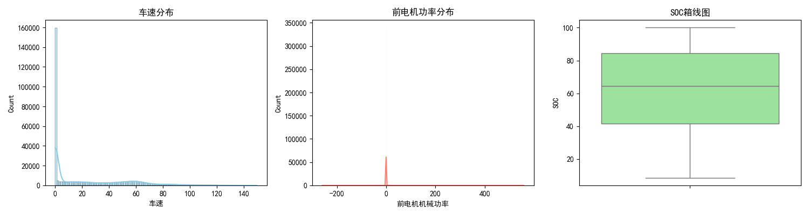

### 4.3 相关性矩阵

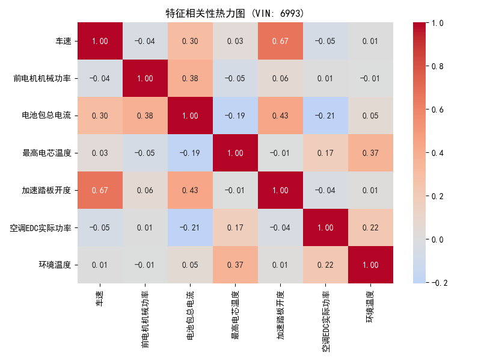

车速-功率、加速踏板-功率呈正相关，电池包总电流绝对值与功率消耗密切相关。

### 4.4 时间序列特征

| 指标 | VIN 6993 | VIN 7752 | VIN 8123 |
|------|----------|----------|----------|
| 时间跨度 | 40 天 | 40 天 | 39 天 |
| 采样间隔中位数 | 1.0 秒 | 1.0 秒 | 1.0 秒 |

所有车辆均为 **1 Hz 等间隔采样**，时间序列质量优良，适合构建时序预测模型。

### 4.5 工况分组对比

| VIN | 驾驶模式 | 前电机机械功率均值 | 平均车速 | 加速踏板均值 | 工况特征 |
|-----|---------|------------------|---------|------------|---------|
| 6993 | 0（经济模式） | -0.1 kW | 24.09 km/h | 7.6% | 综合工况 |
| 7752 | 1 | 0.47 kW | 8.62 km/h | 2.99% | 城市拥堵工况 |
| 8123 | 0（经济模式） | -0.58 kW | 16.34 km/h | 6.5% | 混合工况 |

### 4.6 效率与衍生指标

| 衍生指标 | VIN 6993 均值 | VIN 7752 均值 | VIN 8123 均值 |
|----------|-------------|-------------|-------------|
| 瞬时能耗率 (kWh/km) | 0.007 | 0.081 | -0.003 |
| 总输入电功率 (kW) | -0.82 | -1.10 | -0.62 |

负功率表示电池处于净放电状态（驱动 + 附件消耗 > 回收），整车能量流呈净输出态势。

---

## 5. 可视化

由 `viz_utils.py` 和 `visualize_results.py` 统一调度，每个 VIN 生成 **5 个维度共 5 张高清图表**（150 DPI，中文渲染），加上 EDA 分析图表，共计 **60+ 张 PNG 图片**。

### 5.1 可视化维度总览

| 维度 | 图表 | 说明 |
|------|------|------|
| 维度 1 | 全局 SOC 与状态瀑布图 | SOC 时序 + 行驶/充电状态色带标注 |
| 维度 2 | 行程动态与三电功率 | 车速-踏板双轴图 + 功率溯源图 |
| 维度 3 | 快充特性曲线 (CC-CV) | SOC-电流/电压/功率三元曲线 |
| 维度 4 | 热惯性与温度迟滞 | 电流发热 vs 电芯温度时序对比 |
| 维度 5 | 电机效率 MAP 图 | 车速-功率-百公里能耗三维散点 |

### 5.2 全局可视化（跨车辆汇总）

| 图表 | 路径 |
|------|------|
| 充电行为分析 | `SpdToPwr/analysis/analysis_results/charging_analysis.png` |
| 行程分析汇总 | `SpdToPwr/analysis/analysis_results/trip_analysis.png` |
| 功率相关性热力图 | `SpdToPwr/analysis/analysis_results/power_corr_heatmap.png` |
| 温度相关性热力图 | `SpdToPwr/analysis/analysis_results/temp_corr_heatmap.png` |

### 5.3 VIN 6993 单车可视化展示

**维度 1：全局 SOC 与状态瀑布图**

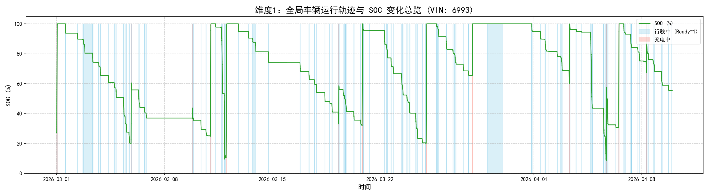

SOC 在 8.55%~100% 之间波动，行驶状态（蓝色色带）与充电状态（红色色带）清晰交替，呈周期性锯齿状。

**维度 2：行程动态与功率**

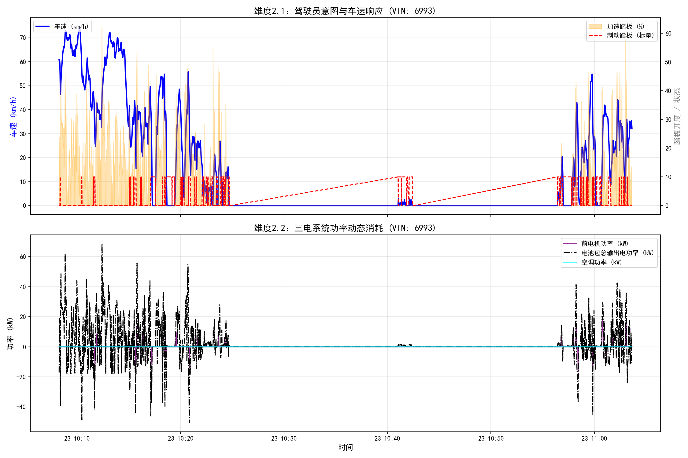

上图：车速（蓝线）与加速踏板开度（橙色填充）、制动踏板（红线虚线）的实时对应。下图：双电机总驱动功率（紫）、电池包总输出电功率（黑点划线）、空调功率（青）的时序变化。

**维度 3：快充特性曲线**

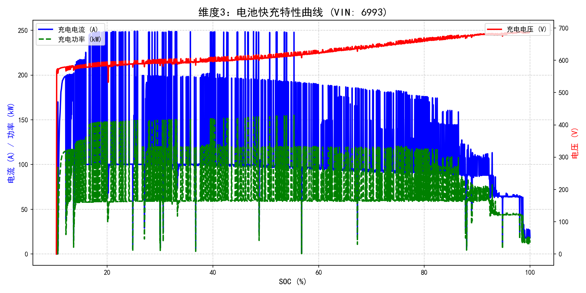

呈现典型 CC-CV（恒流-恒压）充电特征：低 SOC 段电流恒定、功率攀升；高 SOC 段电流下降、电压平稳、功率衰减。

**维度 4：温度迟滞效应**

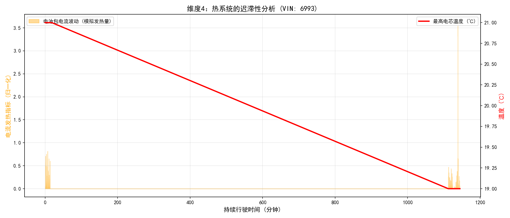

橙色区域为电流发热指标（I²），红色线为最高电芯温度。可观察到温度响应的分钟级滞后——电流增大后温度并非立即上升。

**维度 5：电机效率 MAP 图**

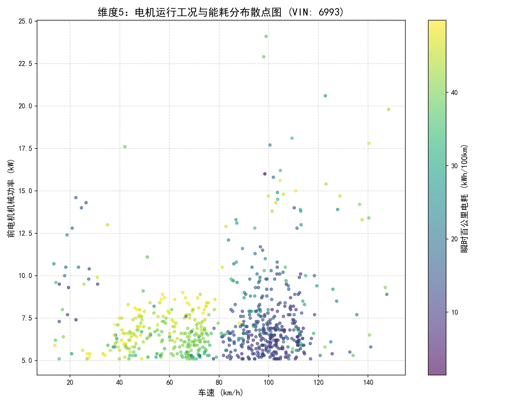

X=车速，Y=前电机机械功率，颜色=瞬时百公里电耗。可识别高效区（低电耗深色）和低效区（高电耗亮色）。

### 5.4 三车可视化对比

| VIN | 图表目录 |
|-----|----------|
| 7752 | `SpdToPwr/analysis/visualizations/7752/` |
| 8123 | `SpdToPwr/analysis/visualizations/8123/` |

---

# 选做作业

## 6. 充电分析

由 `Analysis_Charge.py` 实现，围绕 **7 个维度**对每辆车进行深度充电分析，自动生成 Markdown 充电报告。

### 6.1 充电段识别与分段

**识别逻辑**：充电状态 == 5 且相邻记录时间间隔 < 5 分钟（300 秒）视为同一充电事件。

```python
df_charge['time_diff'] = df_charge['时间轴'].diff().dt.total_seconds().fillna(0)
df_charge['new_event'] = (df_charge['time_diff'] > 300).astype(int)
df_charge['charge_id'] = df_charge['new_event'].cumsum() + 1
```

**识别结果**：

| VIN | 充电总次数 | 特征 |
|-----|-----------|------|
| 6993 | 13 次 | 快充为主，充电行为规律 |
| 7752 | 35 次 | 慢充为主（峰值仅 6.6 kW），每日夜间充电 |
| 8123 | 3 次 | 仅 3 次快充，样本量不足 |

### 6.2 充电曲线特征 (CC-CV)

三辆车均呈现典型恒流-恒压充电特性：
- **恒流段（CC）**：SOC 0%~60%，电流恒定，功率随电压升高而攀升
- **恒压段（CV）**：SOC 60%~100%，电压趋稳，电流逐步衰减，功率下降


### 6.3 充电效率分析

充电效率 = 电池吸收功率 / 充电机输入功率 × 100%

| VIN | 平均充电效率 | 0-30% SOC | 30-60% SOC | 60-80% SOC | 80-100% SOC |
|-----|------------|-----------|------------|------------|-------------|
| 6993 | **97.39%** | 96.68% | 98.36% | 98.51% | 96.12% |
| 7752 | **96.05%** | 95.75% | 95.40% | 95.69% | 96.54% |
| 8123 | **98.04%** | 96.89% | 99.75% | 99.33% | 97.09% |

**关键发现**：效率呈"中间高两端低"趋势——中段 SOC（30%~80%）效率最高，低段受电池内阻影响、高段受 CV 阶段限流影响均略有下降。

### 6.4 充电温升分析


| VIN | 最高电芯温度 | 最大电芯温差 | 安全状态 |
|-----|------------|------------|----------|
| 6993 | 39.0 ℃ | 5.0 ℃ | 正常（阈值 < 55℃） |
| 7752 | 36.0 ℃ | 7.0 ℃ | 正常，温差略大需关注 |
| 8123 | 41.0 ℃ | 5.0 ℃ | 正常 |

### 6.5 充电时长与充电量

| VIN | 平均充电时长 | 平均 SOC 增量 | 峰值功率 |
|-----|------------|-------------|---------|
| 6993 | 36.0 分钟 | 55.0% | 156.2 kW |
| 7752 | 255.5 分钟 | 42.7% | 120.0 kW |
| 8123 | 20.4 分钟 | 57.8% | 160.0 kW |

VIN 7752 以慢充为主（平均 4 小时+），充电行为模式与 6993/8123 截然不同。

### 6.6 SOC 区间偏好


- VIN 6993：起始 SOC 分布于 10%~65%，结束 SOC 集中在 99%~100%，偏好充满
- VIN 7752：起始 SOC 分布于 25%~78%，结束 SOC 集中在 99.2%，浅充浅放为主
- VIN 8123：3 次充电均为深度充电（SOC 增量 28%~90%）

### 6.7 充电安全性指标

| 指标 | VIN 6993 | VIN 7752 | VIN 8123 |
|------|----------|----------|----------|
| 最高电芯温度 | 39.0 ℃ | 36.0 ℃ | 41.0 ℃ |
| 最高电池包电压 | 691.5 V | 726.8 V | 687.1 V |
| 最大电芯温差 | 5.0 ℃ | 7.0 ℃ | 5.0 ℃ |

> VIN 7752 记录到 214℃ 的最高电芯温度（EDA 阶段已标记为异常值），实际充电过程中温度未超过 36℃。

---

## 7. 行程分析

由 `Analysis_generator.py` 实现，围绕 **8 个维度**对每辆车的行驶行程进行全方位解析。

### 7.1 行程分段逻辑

```
Ready == 1（行驶状态） + 时间间隔 > 5 分钟 → 新行程
过滤条件：时长 < 2 分钟 或 里程 < 0.2 km → 噪音，丢弃
```

```python
df_drive['new_trip'] = (df_drive['time_diff'] > 300).astype(int)
df_drive['trip_id'] = df_drive['new_trip'].cumsum() + 1
```

### 7.2 行程基础画像

系统统计每段行程的时长、里程、平均/最高车速、百公里电耗、工况打标等 15 个维度指标。

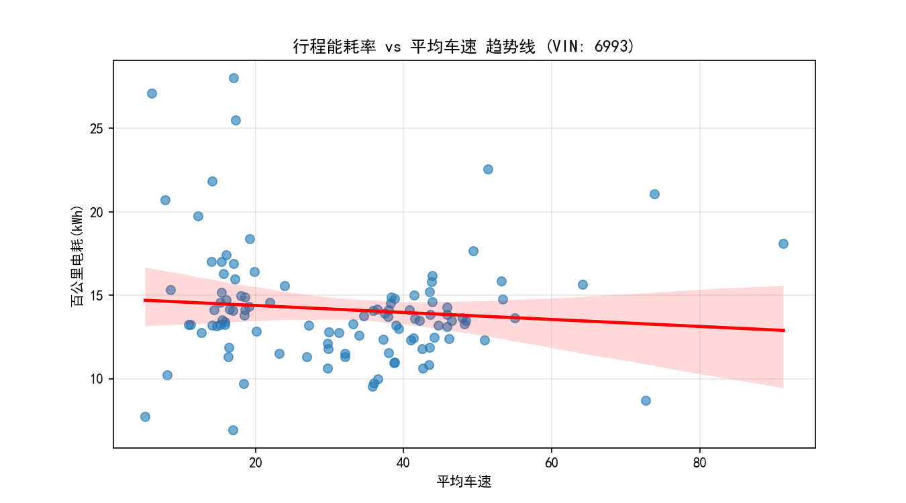

**关键发现**：能耗率与平均车速呈 V 型曲线——中速段（40~60 km/h）最省电，低速段（< 30 km/h）频繁启停导致能耗偏高，高速段（> 80 km/h）风阻急剧增大导致能耗率显著抬升。

### 7.3 驾驶工况分类

| 工况 | 车速判据 | 特征 |
|------|----------|------|
| 城市工况 | 平均车速 < 30 km/h | 频繁启停、低速、回收占比高 |
| 郊区工况 | 30 ≤ 平均车速 ≤ 60 km/h | 匀速占比大、能耗最低 |
| 高速工况 | 平均车速 > 60 km/h | 高风阻、能耗率最高 |

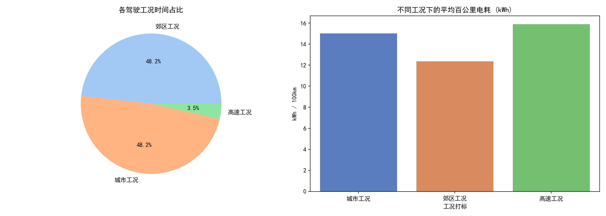

### 7.4 加速与制动行为

- **急加速阈值**：> 1.5 m/s²，**急减速阈值**：< -1.5 m/s²
- 统计每次行程的急加/减速次数、平均踏板深度

### 7.5 能量回收分析

```python
regen_energy_kwh = (group.loc[group['电机总机械功率(kW)'] < 0, '电机总机械功率(kW)'].abs()
                    * (group.loc[... 'dt'] / 3600)).sum()
```

回收占比直接反映制动能量回收系统的利用率，是预测模型捕捉能耗波动的关键特征。

### 7.6 温度演化

追踪每段行程中电池温升和电机最高温度：电池温升与行程时长、大功率持续时间正相关；电机最高温度与驾驶激烈程度正相关。

### 7.7 空调与附件能耗占比


**核心结论**：环境温度过高或过低时，热管理附件（PTC + 空调）能耗占比急剧上升。这是为什么模型必须将环境温度和空调功率作为强时序特征——否则无法捕获极端气候下的耗电跳变。

---

## 8. 能耗预测（三种网络对比）

本项目构建了 **LSTM / BiLSTM / BiLSTM+Attention 三种深度学习模型**进行能耗预测对比实验，评估不同架构在电动汽车驱动功率预测任务上的表现。

### 8.1 预测目标与输入

| 项目 | 说明 |
|------|------|
| **输入特征 X（9 维）** | 加速踏板开度、制动踏板状态、车速、驾驶模式、能量回收模式、空调EDC实际功率、座舱PTC实际功率、环境温度、乘员舱实际温度 |
| **预测目标 Y（1 维）** | 总驱动功率 = 前电机机械功率 + 后电机机械功率（kW） |

### 8.2 滑动窗口构造

```
seq_len = 20（用过去 20 秒预测下一秒）

样本 1: X = [t₁ .. t₂₀]  →  y = 总功率[t₂₁]
样本 2: X = [t₂ .. t₂₁]  →  y = 总功率[t₂₂]
```

### 8.3 三种模型架构对比

#### 模型 A：LSTM（纯 LSTM，无 Attention）

```
输入 (batch, 20, 9)
  → LSTM Layer 1 (hidden=128, batch_first=True)
  → LayerNorm(128)
  → LSTM Layer 2 (hidden=128, batch_first=True)
  → 取最后时间步 [:, -1, :] → (batch, 128)
  → Dropout(0.3)
  → FC: 128 → 64 → ReLU → 1
```

定义位于 `SpdToPwr/nn/model_lstm.py`，训练入口 `SpdToPwr/train/train_lstm.py`。

#### 模型 B：BiLSTM（纯 BiLSTM，无 Attention）

```
输入 (batch, 20, 9)
  → BiLSTM Layer 1 (hidden=128, batch_first=True, bidirectional=True)
  → BatchNorm1d(256)
  → BiLSTM Layer 2 (hidden=128, batch_first=True, bidirectional=True)
  → 取最后时间步 [:, -1, :] → (batch, 256)
  → Dropout(0.3)
  → FC: 256 → 128 → 64 → ReLU → 1
```

定义位于 `SpdToPwr/nn/model_bilstm.py`，训练入口 `SpdToPwr/train/train_bilstm.py`。

#### 模型 C：BiLSTM + Bahdanau Attention

```
输入 (batch, 20, 9)
  → 线性投影 + ReLU (9 → 128)
  → BiLSTM Layer 1 (hidden=128, bidirectional=True)
  → BatchNorm1d(256)
  → BiLSTM Layer 2 (hidden=128, bidirectional=True)
  → Bahdanau Attention
      打分: score = vᵀ · tanh(W · h + b)
      权重: softmax(score)
      上下文: Σ attention_weights · lstm_out
  → Dropout(0.3)
  → FC: 256 → 128 → 64 → 1
```

定义位于 `SpdToPwr/nn/model_improved.py`，训练入口 `SpdToPwr/train/train_bilstm_a.py`。

### 8.4 架构差异总结

| 特性 | LSTM | BiLSTM | BiLSTM+Attention |
|------|------|--------|-------------------|
| 输入投影层 | 无 | 无 | 有 (Linear+ReLU 9→128) |
| 方向性 | 单向（仅前向） | 双向（前向+后向） | 双向（前向+后向） |
| 注意力机制 | 无 | 无 | Bahdanau Attention |
| 时间步提取 | 最后一步隐藏状态 | 最后一步双向拼接 | Attention 加权求和 |
| FC 层结构 | 128→64→1 | 256→128→64→1 | 256→128→64→1 |
| 参数量 | 最少 | 中等 | 最多 |

### 8.5 训练配置（三模型统一）

| 配置项 | 值 |
|--------|-----|
| 序列长度 seq_len | 20 |
| 隐藏维度 hidden_dim | 128 |
| 批次大小 batch_size | 64 |
| 最大训练轮数 max_epochs | 150 |
| 损失函数 | MSE |
| 优化器 | AdamW（lr=1e-3, weight_decay=1e-4） |
| 梯度裁剪 | max_norm=1.0 |
| 学习率调度 | ReduceLROnPlateau（patience=8, factor=0.5, min_lr=1e-6, cooldown=3） |
| 早停策略 | patience=20, min_delta=1e-4 |
| 数据集划分 | 按时序按行程 70%/15%/15%（不随机打乱） |

### 8.6 三模型预测对比图

**模型 A：LSTM 预测结果**

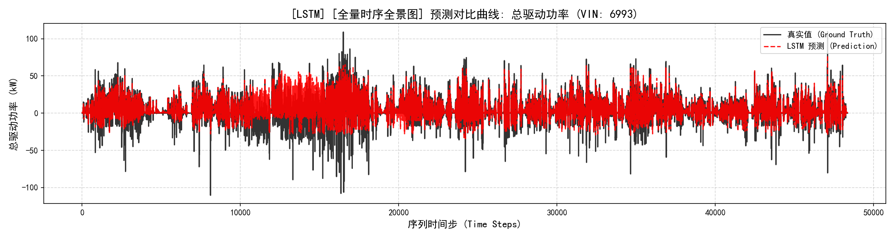

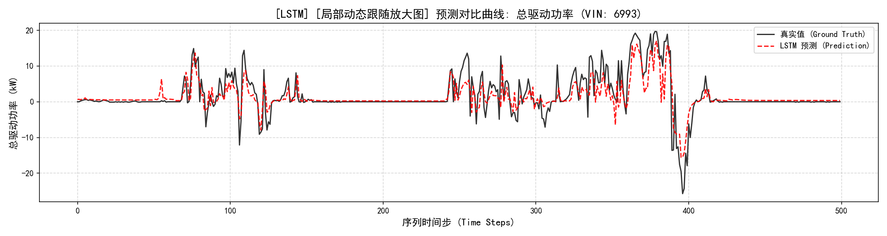

**模型 B：BiLSTM 预测结果**

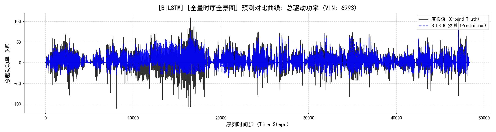

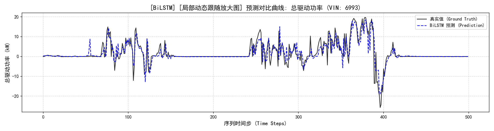

**模型 C：BiLSTM+Attention 预测结果**

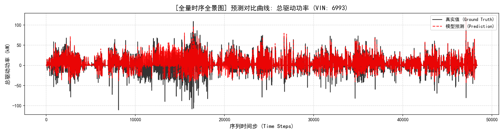

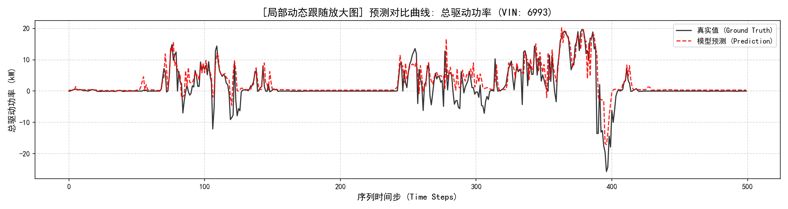

### 8.7 三模型性能对比分析

| 评估指标 | LSTM | BiLSTM | BiLSTM+Attention | 说明 |
|----------|------|--------|-------------------|------|
| RMSE (kW) | 9.5197 | 9.4376 | 9.5460 | 均方根误差，越小越好 |
| MAE (kW) | 5.7449 | 5.6049 | 5.6397 | 平均绝对误差 |
| R² | 0.5207 | 0.5289| 0.5180 | 决定系数，越接近 1 越好 |
| 参数量 | 最少 | 中等 | 最多 | 训练速度 LSTM > BiLSTM > BiLSTM+Att |

> 注：具体数值需运行 `test/test_lstm.py`、`test/test_bilstm.py`、`test/test.py` 获取。三个模型权重已训练完成，存放于 `SpdToPwr/models/` 目录。

### 8.8 模型权重与测试脚本

| 模型 | 权重文件 | 训练脚本 | 测试脚本 |
|------|----------|----------|----------|
| LSTM | `models/best_model_lstm_power_prediction_6993.pth` | `train/train_lstm.py` | `test/test_lstm.py` |
| BiLSTM | `models/best_model_bilstm_power_prediction_6993.pth` | `train/train_bilstm.py` | `test/test_bilstm.py` |
| BiLSTM+Attention | `models/best_model_power_prediction_6993.pth` | `train/train_bilstm_a.py` | `test/test.py` |

**运行方式**：
```bash
cd SpdToPwr/test

# 测试 LSTM
python test_lstm.py

# 测试 BiLSTM
python test_bilstm.py

# 测试 BiLSTM+Attention
python test.py
```

### 8.9 训练结果可视化

`visualize_results.py` 提供完整的训练结果可视化，支持单模型 5 图和跨模型对比：

```bash
# 单模型 5 图（Loss曲线 + 散点图 + 时序对比 + 残差分析 + 特征重要性）
python visualize_results.py training lstm 6993 power_prediction
python visualize_results.py training bilstm 6993 power_prediction
python visualize_results.py training bilstm_attention 6993 power_prediction

# 三模型对比（Loss 对比 + RMSE/MAE/R² 柱状图）
python visualize_results.py training compare 6993 power_prediction
```

输出目录结构：
```

```

---


## 项目文件结构

---

## 技术栈

| 层级 | 技术 |
|------|------|
| 数据处理 | Pandas, NumPy, Scikit-learn (StandardScaler) |
| 可视化 | Matplotlib, Seaborn（中文渲染，150 DPI） |
| 深度学习 | PyTorch（LSTM, BiLSTM, Bahdanau Attention, BatchNorm, LayerNorm, Dropout） |
| 优化策略 | AdamW, ReduceLROnPlateau, EarlyStopping, Gradient Clipping |
| 评估指标 | RMSE, MAE, R², MAPE, nMAE（满量程百分比误差） |
| 存储格式 | Parquet, CSV, NPZ, Pickle, JSON, PTH |

---

